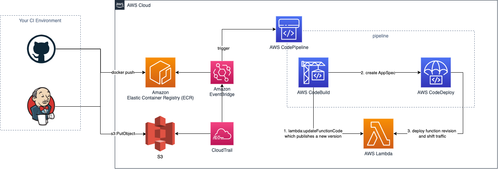

# Lambda function deployments using AWS CodePipeline and AWS CodeDeploy

Terraform module to create AWS resources for blue/green deployments of [Lambda](https://www.terraform.io/docs/providers/aws/r/lambda_function.html) functions
using AWS [CodePipeline](https://docs.aws.amazon.com/codepipeline/latest/userguide/welcome.html) and [CodeDeploy](https://docs.aws.amazon.com/codedeploy/latest/userguide/deployment-steps-lambda.html).

Basic principle for this module is to separate the infrastructure/configuration aspect of Lambda functions (e.g. IAM role, timeouts, runtime, CloudWatch logs)
from continuous deployments of the actual function code.

The latter should be build, tested and packaged (`Zip` or `Image`) on CI systems like GitHub actions and uploaded to AWS (ECR or S3). Controlled,
blue/green deployments of the function code with (automatic) rollbacks and traffic shifting will then be executed on AWS CodePipline using CodeDeploy.



## Features

- fully automated AWS CodePipelines as code to deploy containerized Lambda functions from ECR or zipped packages from S3
- creation of IAM roles with permissions following the [principle of least privilege](https://en.wikipedia.org/wiki/Principle_of_least_privilege) for CodePipeline, CodeBuild and CodeDeploy
  or bring your own roles
- optional CodeStar notifications via SNS

(currently) not supported:

- `BeforeAllowTraffic` and `AfterAllowTraffic` hooks in CodeDeploy

## How do I use this module?

### Initial Terraform run

The Terraform [lambda_function](https://registry.terraform.io/providers/hashicorp/aws/latest/docs/resources/lambda_function) relies
on existing `image_uri` (for containerized functions) or `s3_object_version` (for S3 based packages) in the initial run.

For containerized functions this can be achieved by:

- targeting only `aws_ecr_repository` in the first run and push and initial image before applying the rest of the infrastructure
- using [docker_registry_image](https://registry.terraform.io/providers/kreuzwerker/docker/latest/docs/resources/registry_image) to build the image as part of the terraform lifecycle
- using a `null_resource` with a `local-exec` provisioner to build and push the image as part of the terraform lifecycle, see [container-image (ECR)](../../examples/deployment/container-image)
for a full example

For `Zip` packages on S3 this can be achieved using an `aws_s3_bucket_object` ignoring changes to `etag` and `version_id`, see
[zipped package (S3)](../../examples/deployment/s3) for a full example.

It's recommended to build, test, package and upload all further function code changes using a CI system like GitHub actions.

### using container images

```hcl
locals {
  environment   = "production"
  function_name = "example-with-ecr-codepipeline"
}

resource "aws_lambda_alias" "this" {
  function_name    = module.lambda.function_name
  function_version = module.lambda.version
  name             = local.environment

  lifecycle {
    ignore_changes = [function_version]
  }
}

resource "aws_ecr_repository" "this" {
  name = local.function_name
}

module "deployment" {
  source = "moritzzimmer/lambda/aws//modules/deployment"

  alias_name          = aws_lambda_alias.this.name
  ecr_image_tag       = local.environment
  ecr_repository_name = aws_ecr_repository.this.name
  function_name       = local.function_name
}

module "lambda" {
  source        = "moritzzimmer/lambda/aws"

  function_name                    = local.function_name
  ignore_external_function_updates = true
  image_uri                        = "${aws_ecr_repository.this.repository_url}:${local.environment}"
  package_type                     = "Image"
  publish                          = true
}
```

### using S3 packages

```hcl
locals {
  environment   = "production"
  function_name = "example-with-s3-codepipeline"
  s3_key        = "package/lambda.zip"
}

resource "aws_lambda_alias" "this" {
  function_name    = module.lambda.function_name
  function_version = module.lambda.version
  name             = local.environment

  lifecycle {
    ignore_changes = [function_version]
  }
}

module "deployment" {
  source = "moritzzimmer/lambda/aws//modules/deployment"

  alias_name    = aws_lambda_alias.this.name
  function_name = local.function_name
  s3_bucket     = aws_s3_bucket_object.source.bucket
  s3_key        = local.s3_key
}

module "lambda" {
  source        = "moritzzimmer/lambda/aws"

  function_name                    = local.function_name
  handler                          = "index.handler"
  ignore_external_function_updates = true
  publish                          = true
  runtime                          = "nodejs14.x"
  s3_bucket                        = aws_s3_bucket_object.source.bucket
  s3_key                           = local.s3_key
  s3_object_version                = aws_s3_bucket_object.source.version_id
}

resource "aws_s3_bucket" "source" {
  acl           = "private"
  bucket        = "source-bucket"
  force_destroy = true

  versioning {
    enabled = true
  }
}

resource "aws_s3_bucket_public_access_block" "source" {
  bucket = aws_s3_bucket.source.id

  block_public_acls       = true
  block_public_policy     = true
  ignore_public_acls      = true
  restrict_public_buckets = true
}

// this resource is only used for the initial `terraform apply` - all further
// deployments are running on CodePipeline
resource "aws_s3_bucket_object" "source" {
  bucket = aws_s3_bucket.source.bucket
  key    = local.s3_key
  source = module.function.output_path
  etag   = module.function.output_md5

  lifecycle {
    ignore_changes = [etag, version_id]
  }
}
```

### Examples

- [container-image (ECR)](../../examples/deployment/container-image)
- [zipped package (S3)](../../examples/deployment/s3)

