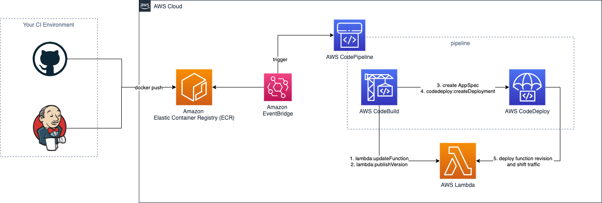

# Lambda function deployments using AWS CodePipeline and AWS CodeDeploy

Terraform module to create AWS resources for blue/green deployments of [Lambda](https://www.terraform.io/docs/providers/aws/r/lambda_function.html) functions
using AWS [CodePipeline](https://docs.aws.amazon.com/codepipeline/latest/userguide/welcome.html) and [CodeDeploy](https://docs.aws.amazon.com/codedeploy/latest/userguide/deployment-steps-lambda.html)

## Features

- fully automated AWS CodePipelines triggered by ECR pushes of containerized Lambda functions
- creation of IAM roles with permissions following the [principle of least privilege](https://en.wikipedia.org/wiki/Principle_of_least_privilege) for CodePipeline, CodeBuild and CodeDeploy
  or bring your own roles
- optional CodeStar notifications via SNS

(currently) not supported:

- S3 based deployments of Lambda functions
- `BeforeAllowTraffic` and `AfterAllowTraffic` hooks in CodeDeploy
- external configuration of CodeBuild infrastructure like `compute_type` or `image`

## Requirements

No requirements.

## Providers

| Name | Version |
|------|---------|
| aws | n/a |

## Inputs

| Name | Description | Type | Default | Required |
|------|-------------|------|---------|:--------:|
| alias\_name | Name of the Lambda alias used in CodeDeploy. | `string` | n/a | yes |
| cloudwatch\_logs\_retention\_in\_days | Specifies the number of days you want to retain log events in the specified log group. | `number` | `14` | no |
| code\_build\_role\_arn | ARN of an existing IAM role for CodeBuild execution. If empty, a dedicated role for your Lambda function with minimal required permissions will be created. | `string` | `""` | no |
| code\_pipeline\_role\_arn | ARN of an existing IAM role for CodePipeline execution. If empty, a dedicated role for your Lambda function with minimal required permissions will be created. | `string` | `""` | no |
| codestar\_notifications\_detail\_type | The level of detail to include in the notifications for this resource. Possible values are BASIC and FULL. | `string` | `"BASIC"` | no |
| codestar\_notifications\_enabled | Enable CodeStar notifications for your pipeline. | `bool` | `true` | no |
| codestar\_notifications\_event\_type\_ids | A list of event types associated with this notification rule. For list of allowed events see https://docs.aws.amazon.com/dtconsole/latest/userguide/concepts.html#concepts-api. | `list(string)` | <pre>[   "codepipeline-pipeline-pipeline-execution-succeeded",   "codepipeline-pipeline-pipeline-execution-failed" ]</pre> | no |
| codestar\_notifications\_target\_arn | Use an existing ARN for a notification rule target (for example, a SNS Topic ARN). Otherwise a separate sns topic for this service will be created. | `string` | `""` | no |
| deployment\_config\_name | The name of the deployment config used in the CodeDeploy deployment group. | `string` | `"CodeDeployDefault.LambdaAllAtOnce"` | no |
| ecr\_image\_tag | The tag used for the Lambda container image. | `string` | `"latest"` | no |
| ecr\_repository\_name | Name of the ECR repository source used for deployments. | `string` | n/a | yes |
| function\_name | The name of your Lambda Function to deploy. | `string` | n/a | yes |
| tags | A mapping of tags to assign to all resources supporting tags. | `map(string)` | `{}` | no |

## Outputs

No output.